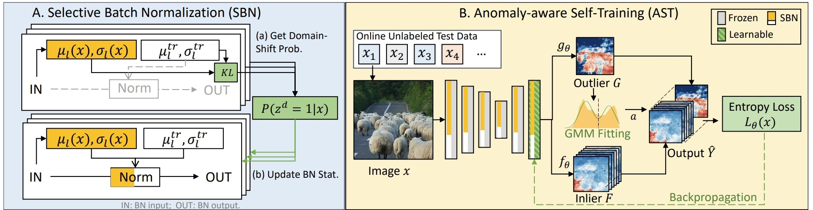

# ⚖️ATTA: Anomaly-aware Test-Time Adaptation for Out-of-Distribution Detection in Segmentation
Welcome to the official code repository for [*ATTA: Anomaly-aware Test-Time Adaptation for Out-of-Distribution Detection in Segmentation*](https://openreview.net/pdf?id=bGcdjXrU2w) by Zhitong Gao, Shipeng Yan, and Xuming He (NeurIPS 2023). 
This work introduces a novel framework to enhance the robustness of dense out-of-distribution (OOD) detection models against domain shifts through test-time adaptation techniques.

*Overview of the proposed Anomaly-aware Test-Time Adaptation (ATTA) framework.*


*Visualization of ATTA adaptation results on the RoadAnomaly dataset.*

Other Resources: [[Poster](https://gaozhitong.github.io/posters/poster-atta.pdf) | [Slides](https://gaozhitong.github.io/slides/slides-atta.pdf)]

## 🌟Features
- **Innovative Test-Time Adaptation**: ATTA focuses on adapting models at test time to jointly tackles domain and semantic shifts.
- **Benchmarking on Diverse Datasets**: Extensive evaluation on datasets with simulated and real-world domain shifts to ensure robust performance across varied scenarios.
- **Modular Codebase**: Easy integration and testing of different OOD detection methods and adaptation strategies.

## 🛠 Preparation
### 1️⃣ Environment Setup
Ensure you have the correct environment for running the models. The code has been tested on CUDA 10.1 and 11.3. You can use the provided [conda environment file](environment.yml) for setup.
```python
conda env create -f environment.yaml
```
### 2️⃣ Model Preparation
We support the integration of several existing OOD detection models, such as [Max Logit](https://arxiv.org/pdf/1911.11132.pdf) and [PEBAL](https://arxiv.org/pdf/2111.12264.pdf).
Follow [setup_pretrained_models.md](docs/setup_pretrained_models.md) to prepare the pretrained checkpoints and set up the path. 
You can also add your own OOD detection models to [method_module.py](lib/method_module.py) with only a few lines of code.

### 3️⃣ Dataset Preparation
We evaluate the method on various OOD segmentation datasets, including those with significant domain shifts and those
without based on RoadAnomaly, SMIYC, and Fishyscapes. Follow [setup_datasets.md](docs/setup_datasets.md) to set up these datasets.

## 🏃‍♂️Running the Adaptation
After completing the necessary preparations, you are now ready to run the test-time adaptation. Start with the following command:
```bash
# Example command for running our test-time adaptation for PEBAL on the Road Anomaly dataset.
python main.py --cfg 'exp/atta.yaml' --dataset RoadAnomaly --method PEBAL
```
### 🔧 Choosing Your Configuration
The command includes several parameters you can adjust to fit your specific requirements. Here's how you can change each part:

* `--dataset`: Select the dataset for testing. Replace 'RoadAnomaly' with 'FS_Static', 'FS_LostAndFound', or 'FS_Static_C' to test different datasets. ('FS_Static_C' means the FS Static dataset with added domain-shift.)
* `--method`: Choose the OOD detection method. Replace 'PEBAL' with 'Max_logit', 'Energy', or any other integrated method.
* `--cfg`: Select from different configuration files in the '/exp' directory for various adaptation strategies or baseline configurations, such as 'tent.yaml', 'TBN.yaml', or 'baseline.yaml'.

Here are some examples of how you might configure the command for different scenarios:
```bash
# Using a different adaptation strategy (Tent) with PEBAL on FS_Static_C.
python main.py --cfg 'exp/tent.yaml' --dataset FS_Static_C --method PEBAL
# Direct inference with Max_logit on FS_LostAndFound.
python main.py --cfg 'exp/baseline.yaml' --dataset FS_LostAndFound --method Max_logit
```
By default, the FS_Static_C dataset is generated by applying a mix of domain shifts to images from the FS_Static dataset. If you wish to specify a particular type of domain shift, such as fog, you can use the --trans_type argument.
For example, to apply a fog transformation, use the following command:
```bash
python main.py --cfg 'exp/atta.yaml' --dataset FS_Static_C --method PEBAL --trans_type fog
```

#📄 Citation
If you find our work helpful for your research, please consider citing our paper:
```bibtex
@inproceedings{
gao2023atta,
title={{ATTA}: Anomaly-aware Test-Time Adaptation for Out-of-Distribution Detection in Segmentation},
author={Zhitong Gao and Shipeng Yan and Xuming He},
booktitle={Thirty-seventh Conference on Neural Information Processing Systems},
year={2023},
url={https://openreview.net/forum?id=bGcdjXrU2w}
}
```
# 🙏Acknowledgement
We express our gratitude to the authors of the following codebases which have been instrumental in the development of this code repository: 
[SMIYC](https://github.com/SegmentMeIfYouCan/road-anomaly-benchmark), [PEBAL](https://github.com/tianyu0207/PEBAL/), [Tent](https://github.com/DequanWang/tent).

# ✉️ Contact
If you have any issues or questions related to the code, please feel free to open an issue on GitHub. 
For general discussions, suggestions, or further assistance, you can reach out to me (Zhitong Gao) via email at [gaozht@shanghaitech.edu.cn](mailto:gaozht@shanghaitech.edu.cn).

